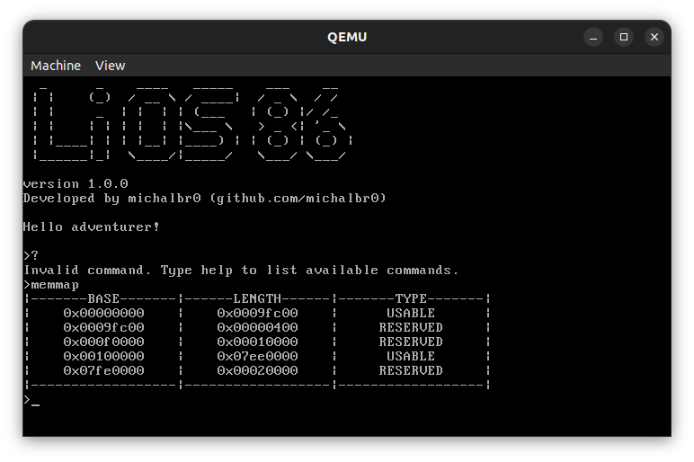

# LiOS86

## Overview

A simple, toy x86 operating system written in C++.

Features implemented in the current version (`1.0.0`):
- bootloader
- interrupt handling
- simple interactive shell
- crude dynamic memory allocation

Not yet implemented:
- virtual memory support
- disk access & filesystem support
- concurrency support

The provided `Makefile` supports compiling the operating system from source (using an i386 [cross-compiler](https://wiki.osdev.org/GCC_Cross-Compiler)), generating a disk image and running it in `qemu` emulator.

## Useful resources

- [OS Dev wiki](https://wiki.osdev.org/Main_Page)
